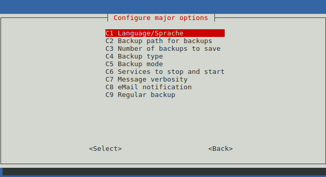

  

# raspiBackup - Backup and restore your running Raspberries

* Create an unattended full or incremental system backup with no shutdown of the system or any other manual intervention just by starting raspiBackup using cron.
* Restore any of the created backups. 
* Important services can be stopped before starting the backup and are started again when the backup finished.
* Menu driven installer installs raspiBackup and configures all major options to get raspiBackup up and running in 5 minutes
* Any device mountable on Linux can be used as backup space (local USB disk, remote nfs drive, remote samba share, remote ssh server using sshfs, remote ftp server using curlftpfs, webdav drive using davfs, ...).
* Standard Linux backup tools dd, tar and rsync can be used to create the backup.
* dd and tar are full backups. rsync uses hardlinks for incremental backups
* Restore a SD card image backup to SSD or USB disk and migrate to use USB boot mode 
* Result of backup run can be sent via eMail or to Telegram
* Smart recycle backup strategy supported (e.g. save backups of last 7 days, last 4 weeks, last 12 months and last n years) - also known as grandfather, father and son backup rotation principle
* Extensionpoints allow to execute any additional logic at various steps in the backup process
* Default language for messages is English. Following languages are supported native:
  * German
  * Finnish
  * Chinese
  * French
* Extensive logging helps to answer github issues create by raspiBackup users
* Much more features ... (See doc below)

## Documentation

### English
* [Installation](https://www.linux-tips-and-tricks.de/en/quickstart-rbk)
* [Users guide](https://www.linux-tips-and-tricks.de/en/backup)
* [FAQ](https://www.linux-tips-and-tricks.de/en/faq)

### German
* [Installation](https://www.linux-tips-and-tricks.de/de/schnellstart-rbk/)
* [Benutzerhandbuch](https://www.linux-tips-and-tricks.de/de/raspibackup)
* [FAQ](https://www.linux-tips-and-tricks.de/de/faq)

### French

This README was translated into [French](README_fr). Credits to [mgrafr](https://github.com/mgrafr) for his translation work.

## Installer

The installer uses menus, checklists and radiolists similar to raspi-config and helps to install and configure major options of raspiBackup and in 5 minutes the first backup can be created.





### Installer demo


Installation is started with following command:

`curl -s https://raw.githubusercontent.com/framps/raspiBackup/master/installation/install.sh | sudo bash`

## Donations

raspiBackup is maintained and supported by just me - framp. I appreciate donations if you find raspiBackup useful. For details how to donate see [here](https://www.linux-tips-and-tricks.de/en/donations/)

## Feature requests

Anybody is welcome to create feature requests in github. They are either immediately scheduled for the next release or moved into the [backog](https://github.com/framps/raspiBackup/issues?q=is%3Aissue+is%3Aclosed+label%3ABacklog). The backlog will be reviewed every time a new release is planned and some issues are picked up and will be implemented in the next release. If you find some features useful just add a comment to the issue with :+1:. This helps to prioritize the issues in then backlog.

## Nitty gritty details

 * [English](https://www.linux-tips-and-tricks.de/en/all-pages-about-raspibackup/)
 * [German](https://www.linux-tips-and-tricks.de/de/alles-ueber-raspibackup/)

## Social media

 * [Youtube](https://www.youtube.com/channel/UCnFHtfMXVpWy6mzMazqyINg) - Videos in English and German
 * [Twitter](https://twitter.com/linuxframp) - News and announcements - English only
 * [Facebook](https://www.facebook.com/raspiBackup) - News, discussions, announcements and misc background information in English and German

## Miscellaneous sample scripts [(Code)](https://github.com/framps/raspiBackup/tree/master/helper)

* Sample wrapper scripts to add any activities before and after backup [(Code)](https://github.com/framps/raspiBackup/blob/master/helper/raspiBackupWrapper.sh)

* Sample wrapper script which checks whether a nfsserver is online, mounts one exported directory and invokes raspiBackup. If the nfsserver is not online no backup is started. [(Code)](https://github.com/framps/raspiBackup/blob/master/helper/raspiBackupNfsWrapper.sh)

* Sample script which restores an existing tar or rsync backup created by raspiBackup into an image file and then shrinks the image with [pishrink](https://github.com/Drewsif/PiShrink). Result is the smallest possible dd image backup. When this image is restored via dd or windisk32imager it's expanding the root partition to the maximum possible size. [(Code)](https://github.com/framps/raspiBackup/blob/master/helper/raspiBackupRestore2Image.sh)

## Sample extensions [(Code)](https://github.com/framps/raspiBackup/tree/master/extensions)
* Sample eMail extension
* Sample pre/post extension which reports the memory usage before and after backup
* Sample pre/post extension which reports the CPU temperature before and after backup
* Sample pre/post extension which reports the disk usage on the backup partition before and after backup and the absolute and relative change
* Sample pre/post extension which initiates different actions depending on the return code of raspiBackup
* Sample ready extension which copies /etc/fstab into the backup directory

## Systemd

Instead of cron systemd can be used to start raspiBackup. See [here](installation/systemd) (thx [Hofei](https://github.com/Hofei90)) for details.

# REST API Server proof of concept

Allows to start raspiBackup from a remote system or any web UI.
1. Download executable from [RESTAPI directory](https://github.com/framps/raspiBackup/tree/master/RESTAPI)
2. Create a file /usr/local/etc/raspiBackup.auth and define access credentials for the API. For every user create a line userid:password
3. Set file attributes for /usr/local/etc/raspiBackup.auth to 600
4. Start the RESTAPI with ```sudo raspiBackupRESTAPIListener```. Option -a can be used to define another listening port than :8080.
5. Use ```curl -u userid:password -H "Content-Type: application/json" -X POST -d '{"target":"/backup","type":"tar", "keep": 3}' http://<raspiHost>:8080/v0.1/backup``` to kick off a backup.
