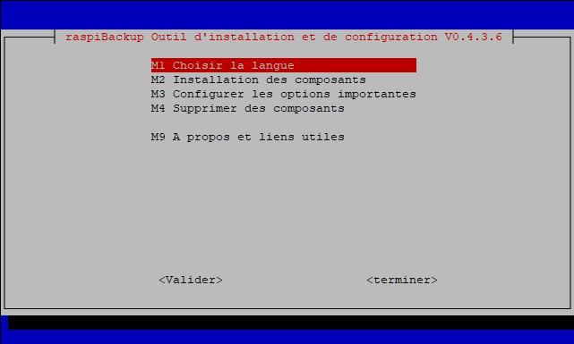
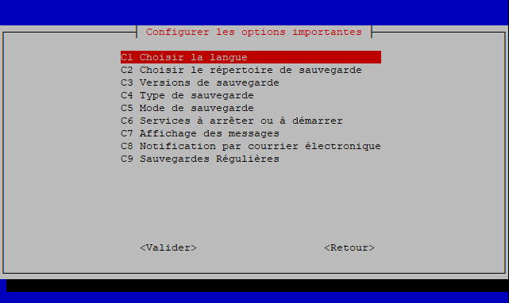
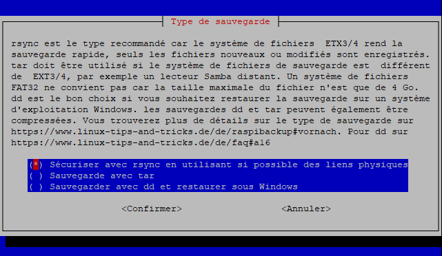

 

# raspiBackup - Pour sauvegarder et restaurer les Raspberry PI en cours d’exécution

* Pour créer une sauvegarde complète sans l'arrêter du système , sans toute autre intervention simplement en démarrant raspiBackup à l’aide de cron. Les services importants peuvent être arrêtés (c'est recommandé) avant le démarrage de la sauvegarde et sont redémarrés une fois la sauvegarde terminée.
* Tout périphérique monté sous Linux peut être utilisé comme espace de sauvegarde (disque externe USB , lecteur nfs , partage samba ,serveur ssh utilisant sshfs, serveur ftp utilisant curlftpfs, lecteur webdav utilisant davfs, ...).
* Les outils de sauvegarde et de compression Linux dd, tar et rsync sont proposés et peuvent être choisis pour créer la sauvegarde.
* La partition Root externe pour les systèmes qui ne prennent pas en charge le mode de démarrage USB et les systèmes de démarrage USB sont pris en charge.
* La migration d’un système basé sur une carte SD est facile: il suffit de restaurer sur un SSD la sauvegarde faite sur la carte SD.
* Le résultat de l’exécution de la sauvegarde peut être envoyé par e-mail ou par Telegram
* L'interface graphique raspiBackupInstallUI permet de configurer toutes les principales options pour que raspiBackup soit opérationnel en 5 minutes.
* Avec cette interface utilisateur raspiBackupInstallUI permet de configurer une sauvegarde grand-père-père-fils (GFS) qui est l'un des schémas de sauvegarde intelligente les plus populaires. Il vous permet d'enregistrer les sauvegardes des 7 derniers jours, des 4 dernières semaines, des 12 derniers mois et des n dernières années).
* Messages en anglais, allemand, finnois ,français et chinois
* Pour connître toutes les fonctionnalités ... voir le document ci-dessous

## Documentation

### Anglais
* [Installation](https://www.linux-tips-and-tricks.de/en/quickstart-rbk)
* [Users guide](https://www.linux-tips-and-tricks.de/en/backup)
* [FAQ](https://www.linux-tips-and-tricks.de/en/faq)

### Allemand
* [Installation](https://www.linux-tips-and-tricks.de/de/schnellstart-rbk/)
* [Benutzerhandbuch](https://www.linux-tips-and-tricks.de/de/raspibackup)
* [FAQ](https://www.linux-tips-and-tricks.de/de/faq)

## Installation

Le programme d’installation utilise des menus, des listes et des boutons radio, similaires à raspi-config,  et aide à l'installation et à la configuration des principales options de raspiBackup ; en 5 minutes, la première sauvegarde peut être créée.

### Démo de l’installation depuis l'interface utilisateur (en anglais)

L’installation démarre avec la commande suivante :

`curl -s https://raw.githubusercontent.com/framps/raspiBackup/master/installation/install.sh | sudo bash`

## Dons

raspiBackup est développé et maintenu uniquement par moi, framp. Les dons seront les bienvenus si vous trouvez raspiBackup utile. Pour plus de détails sur la façon de faire un don, voir <a href="https://www.linux-tips-and-tricks.de/en/donations/" rel="nofollow" _istranslated="1">ici</a>

## Demandes de fonctionnalités

Vous êtes invité à créer vos demandes de fonctionnalités dans github. Ils seront soit immédiatement programmées pour la prochaine version, soit déplacées dans le backog. Les taches priorisées seront examinées chaque fois qu’une nouvelle version sera planifiée et que certains problèmes détectés auront été résolus. Si vous trouvez certaines fonctionnalités utiles, ajoutez simplement un commentaire au problème avec :+1:. Cela aide à hiérarchiser les problèmes.

## Plus de détails sur les fonctionnalités en anglais ou allemand

 * [English](https://www.linux-tips-and-tricks.de/en/all-pages-about-raspibackup/)
 * [German](https://www.linux-tips-and-tricks.de/de/alles-ueber-raspibackup/)

## Réseaux sociaux

 * [Youtube](https://www.youtube.com/channel/UCnFHtfMXVpWy6mzMazqyINg) - Vidéos en anglais et allemand
 * [Twitter](https://twitter.com/linuxframp) - Nouvelles et annonces - Anglais uniquement
 * [Facebook](https://www.facebook.com/raspiBackup) - Actualités, discussions, annonces et informations générales en anglais et en allemand

## Exemples de scripts divers [(Code)](https://github.com/framps/raspiBackup/tree/master/helper)

* Exemples de scripts wrapper pour ajouter des activités avant et après la sauvegarde [(Code)](https://github.com/framps/raspiBackup/blob/master/helper/raspiBackupWrapper.sh)

* Exemple de script wrapper qui vérifie si un server nfs est en ligne, monte un répertoire exporté et appelle raspiBackup. Si le server nfs n’est pas en ligne, aucune sauvegarde ne sera démarrée [(Code)](https://github.com/framps/raspiBackup/blob/master/helper/raspiBackupNfsWrapper.sh)

* Exemple de script qui restaure une sauvegarde tar ou rsync existante créée par raspiBackup dans un fichier image, puis réduit l’image avec [pishrink](https://github.com/Drewsif/PiShrink). Le résultat est la plus petite sauvegarde d’image dd possible. Lorsque cette image est restaurée avec dd ou win32Disk32Imager, la partition Root est étendue à la taille maximale possible. [(Code)](https://github.com/framps/raspiBackup/blob/master/helper/raspiBackupRestore2Image.sh)

## Exemples d’extensions [(Code)](https://github.com/framps/raspiBackup/tree/master/extensions)
* Exemple d’extension e_mail
* Exemple d’extension pré/post qui indique l’utilisation de la mémoire avant et après la sauvegarde
* Exemple d’extension pré/post qui indique la température du processeur avant et après la sauvegarde
* Exemple d’extension pré/post qui indique l’utilisation du disque sur la partition de sauvegarde avant et après la sauvegarde
* Exemple d’extension pré/post qui initie différentes actions en fonction du code de retour de raspiBackup
* Exemple d’extension qui copie /etc/fstab dans le répertoire de sauvegarde

## Systemd

Au lieu de cron systemd peut être utilisé pour démarrer raspiBackup. Voir [ici](../installation/systemd)

# Démonstration du concept du serveur REST API

Permet de démarrer raspiBackup à partir d’un système distant ou de n’importe quelle interface utilisateur Web.

1.Télécharger l’exécutable à partir du répertoire RESTAPI
2.Créer un fichier /usr/local/etc/raspiBackup.auth et définir les informations d’identification d’accès pour l’API. Pour chaque utilisateur, créer une ligne userid:password

4.Définir les attributs de fichier pour /usr/local/etc/raspiBackup.auth sur 600

5.Démarrer RESTAPI avec : sudo raspiBackupRESTAPIListener. L’option -a peut être utilisée pour définir un autre port d’écoute que :8080.

6.Pour lancer une sauvegarde : curl -u userid:password -H "Content-Type: application/json" -X POST -d '{"target":"/backup","type":"tar", "keep": 3}' http://<raspiHost>:8080/v0.1/backup
